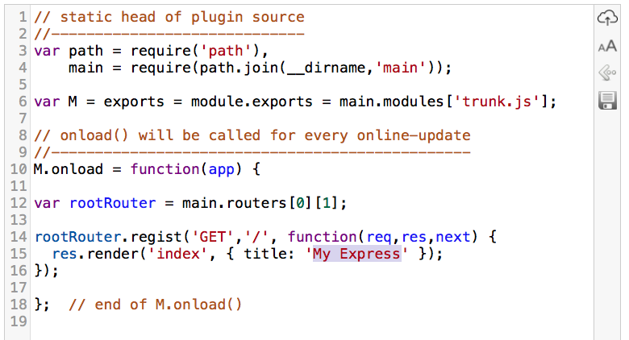

Online-express: Live/hot update your code
=========================================

简介：基于 NodeJS 与 express 的在线开发系统
---------------------------------------

这是一个用于 WebService 服务侧的一个开发框架，本系统基于 <a target="_blank" href="http://expressjs.com/">express</a> 框架，
开发语言要求用 NodeJS。  

使用本框架的好处是：把 WebService 跑起来后，你可以在线更新程序逻辑，即：Online-express 框架提供一种插件机制，
可以动态更新各插件的处理逻辑，在软件调测阶段使用它，可以避免服务侧程序反复重新启动，提高持续敏捷开发的工作效率。

使用方法
-------

**第1步**：克隆本项目

```
git clone https://github.com/cse-soft/online-express.git
cd online-express
```

**第2步**：在本机启动 WebService，以此模拟服务侧程序

```
DEBUG=myapp:* npm start
```

注：这个启动采用 Express 建议的方式，更多启动参数请参考 Express 文档。

**第3步**：在 Web 浏览器中打开： `http://localhost:3000/`

当你看到界面有 "Welcome to Express" 信息显示时，表明前面操作都是正确的。到这一步，展示的功能实际上是
express 框架自身就带的。接下来，我们要展示在线编辑与在线更新服务侧代码。

**第4步**：在 Web 浏览器新建一页中打开： `http://localhost:3000/develop/editor.html`

打开编辑器界面后，点击右侧 *load source file* 按钮（右上角第3个按钮），导入 trunk.js 文件，
这个文件在工程路径的 plugins 子目录下，已被服务侧程序导入使用。

如下图，把源码 `{ title: 'Express' }` 改成 `{ title: 'My Express' }`，然后按 ctrl+s（或cmd+s）
热键保存。



**第5步**：在线更新程序

现在把上一步修改，直接更新到 WebService 服务中去，按 ctrl+alt+s（或cmd+alt+s）热键即完成更新。
回到早些我们已打开的 `localhost:3000` 页面，刷新（重新导入）这个面页，您可发现标题将变换到 "My Express"，
说明我们刚修改的代码已经生效了。

如何定义插件？
-----------

上面演示的 trunk.js 文件就是一个插件，plugins/main.js 定义了如下代码：

```
exports = module.exports = {
  sources: [   // define source module table
    'trunk.js',
  ],
  
  routers: [   // define root-router table
    ['/', express.Router()],
  ],
};
```

你可以自己追加一个插件文件，比如：test.js，新增插件处理 "/test/..." 的 Web 请求，上面代码可写成如下样子：

```
exports = module.exports = {
  sources: [   // define source module table
    'trunk.js',
    'test.js',
  ],
  
  routers: [   // define root-router table
    ['/', express.Router()],
    ['/test/', express.Router()],
  ],
};
```

然后仿照 `trunk.js`，编写如下代码，保存到 `plugins/test.js` 文件中：

```
// static head of plugin source
//-----------------------------
var path = require('path'),
    main = require(path.join(__dirname,'main'));

var M = exports = module.exports = main.modules['test.js'];

// onload() will be called for every online-update
//------------------------------------------------
M.onload = function(app) {

var testRouter = main.routers[0][1];

testRouter.regist('GET','/test1', function(req,res,next) {
  res.send('responsed from /test/test1');
});

};  // end of M.onload()
``` 

注意：当你增加（或删除）插件文件时，服务侧程序要重启！

现有你两件插件模块了，trunk.js 与 test.js，如果把本服务程序布署到一个公共服务器，可供多人同时调测，
比如：你负责开发 trunk.js，另一位同事负责 test.js。

插件文件的编码要求（请参考 trunk.js）
-------------------------------

使用如下语句定义当前模块（变量M），更新该模块代码时，M 值从 main.modules 缓存区取回，所以，挂在 M
下的变量得以保留并重用。

```
var M = exports = module.exports = main.modules['trunk.js'];
```

因为要支持在线代码更新，插件代码要满足 **“可多次、无干扰执行”** 的要求。比如下面代码是满足这项要求的：

```
var myBuff = M.myBuff = M.myBuff || [];
```

当这句代码首次执行时，`M.myBuff` 并不存在，所以 `M.myBuff = M.myBuff || [];` 
实际效果是：在 M 下定义 myBuff 变量，用 `var myBuff = M.myBuff` 再定义 myBuff 变量是为了使用方便
（否则每次都要写成 `M.myBuff`）。当这行代码第二次（或其后 N 次）执行时，`myBuff` 可正常取回历史旧值。

`Router.regist(sMethod,sPath,func)` 对 Exresss 中的 `Router[sMethod](sPath,func)`
做了封装（参见 application.js 中代码），目的也是让 Express 的路由注册满足 **无干扰多次执行**
的要求。这样，你能改写已定义的路由，也能增加新路由后，高效的敏捷开发环境就搭起来了。

在线代码更新时，如果遭遇更新失败，您可以打开浏览器的命令行窗口查看详细信息，出错时服务侧的 NodeJS 调用栈已用
console.log() 打印。

相关配置
-------

当环境变量 NODE_ENV 未定义，或其值为 `development` 时，启动的服务程序支持在线调测，
如果把这个环境变量的值改为 `product`，再启动服务程序，在线代码更新特性将被关闭。应用于生产的环境，
需要关闭这个特性，否则，您的系统将残留致命后门。

工程路径下的 public 目录被配置为静态目录，`public/develop` 下定义了供客户端使用的在线编辑器（见上面第4步介绍），
`public/develop/config.json` 是在线编辑器的配置文件，你可手工修改相关配置项。

版权
----

Copyright 2015, CSE-SOFT Development Group. All rights reserved.

Redistribution and use in source and binary forms, with or without
modification, are permitted provided that the following conditions
are met:

  - Redistributions of source code must retain the above copyright
    notice, this list of conditions and the following disclaimer.
  - Redistributions in binary form must reproduce the above
    copyright notice, this list of conditions and the following
    disclaimer in the documentation and/or other materials provided
    with the distribution.
  - Neither the name of PINP.ME nor the names of its contributors 
    may be used to endorse or promote products derived from this 
    software without specific prior written permission.

THIS SOFTWARE IS PROVIDED BY THE COPYRIGHT HOLDERS AND CONTRIBUTORS
"AS IS" AND ANY EXPRESS OR IMPLIED WARRANTIES, INCLUDING, BUT NOT
LIMITED TO, THE IMPLIED WARRANTIES OF MERCHANTABILITY AND FITNESS FOR
A PARTICULAR PURPOSE ARE DISCLAIMED. IN NO EVENT SHALL THE COPYRIGHT
OWNER OR CONTRIBUTORS BE LIABLE FOR ANY DIRECT, INDIRECT, INCIDENTAL,
SPECIAL, EXEMPLARY, OR CONSEQUENTIAL DAMAGES (INCLUDING, BUT NOT
LIMITED TO, PROCUREMENT OF SUBSTITUTE GOODS OR SERVICES; LOSS OF USE,
DATA, OR PROFITS; OR BUSINESS INTERRUPTION) HOWEVER CAUSED AND ON ANY
THEORY OF LIABILITY, WHETHER IN CONTRACT, STRICT LIABILITY, OR TORT
(INCLUDING NEGLIGENCE OR OTHERWISE) ARISING IN ANY WAY OUT OF THE USE
OF THIS SOFTWARE, EVEN IF ADVISED OF THE POSSIBILITY OF SUCH DAMAGE.
